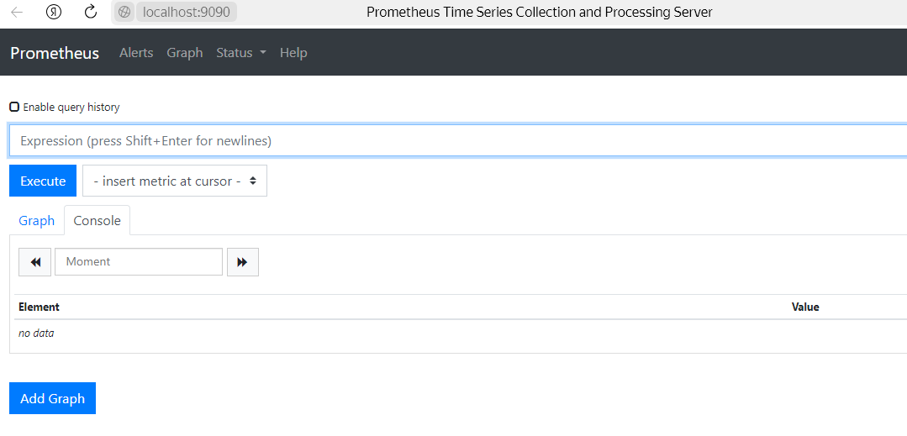
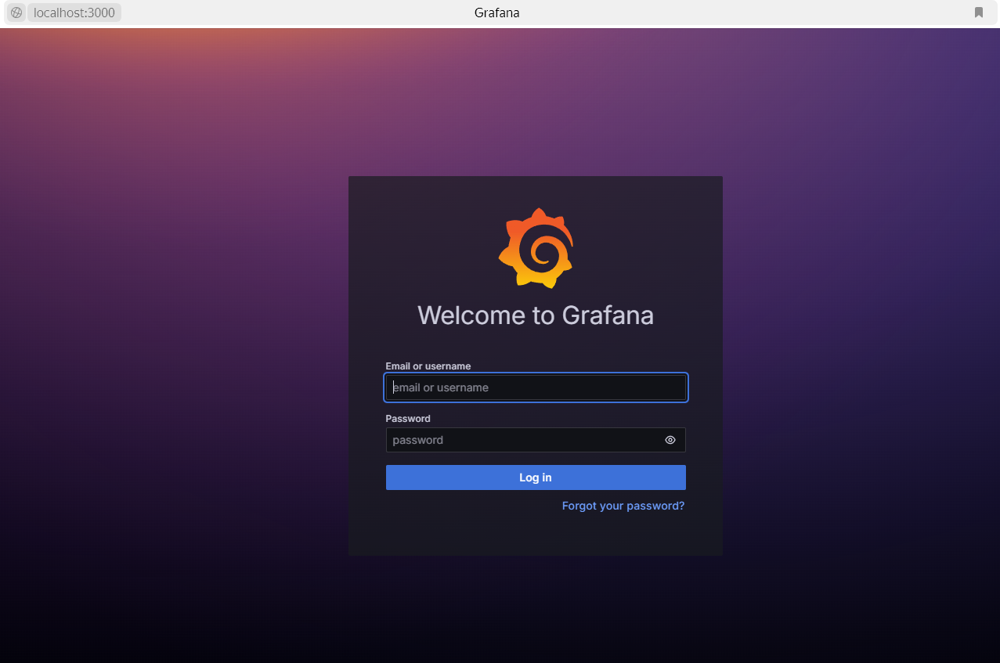
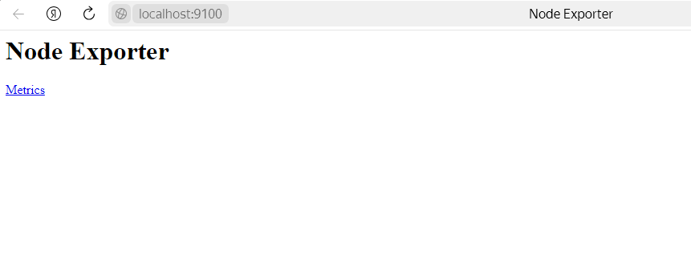
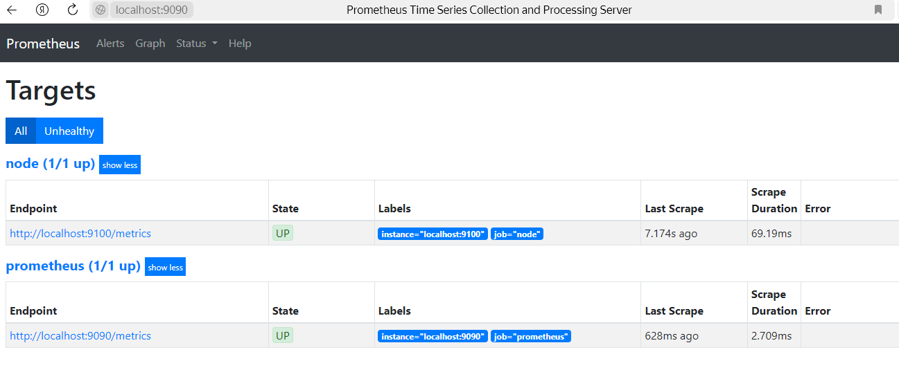
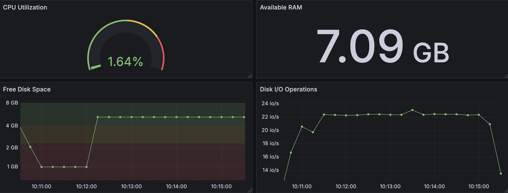
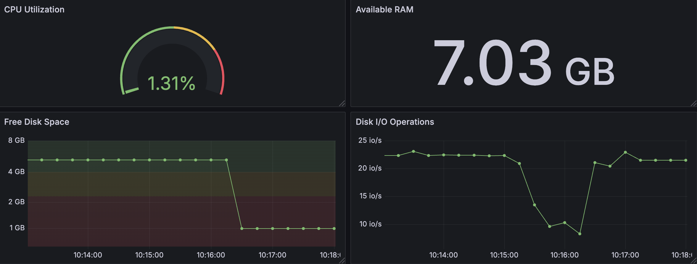
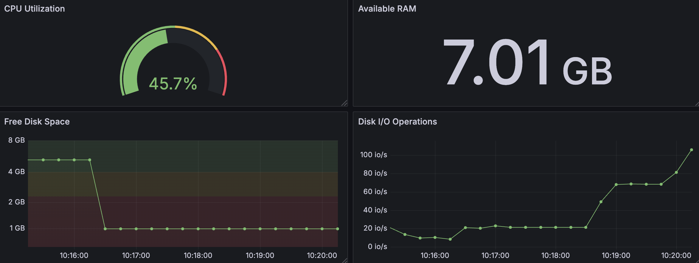

# Part 7. Prometheus и Grafana

## Содержание

1. [Установка Prometheus](#1-установка-prometheus)
2. [Настройка Prometheus](#2-настройка-prometheus)
3. [Установка Grafana](#3-установка-grafana)
4. [Установка Node Exporter](#4-установка-node-exporter)
5. [Настройка Grafana](#5-настройка-grafana)
6. [Создание дашборда в Grafana](#6-создание-дашборда-в-grafana)
7. [Мониторинг](#7-мониторинг)


## 1. Установка Prometheus

* Обновить системные пакеты: <br/>
  ```sh
  $ sudo apt update
  ```

* Установка `Prometheus`<br/>
  ```sh
  $ sudo apt install prometheus
  ```

## 2. Настройка Prometheus

* Запустить службу `Prometheus`<br/>
  ```sh
  $ sudo systemctl enable prometheus
  $ sudo systemctl start prometheus
  ```

* Проверить состояние `Prometheus`<br/>
  ```sh
  $ sudo systemctl status prometheus
  ```

* Проверить доступ к веб-интерфейсу `Prometheus`<br/>
  По умолчанию `Prometheus` работает на `порту 9090`:<br/>

  <br/>

## 3. Установка Grafana

Перед следующими действиями необходимо включить VPN:<br/>

* Установить необходимые пакеты:<br/>
  ```sh
  $ sudo apt-get install -y apt-transport-https software-properties-common wget
  ```

* Импортировать ключ GPG:<br/>
  ```sh
  $ sudo mkdir -p /etc/apt/keyrings/

  $ wget -q -O - https://apt.grafana.com/gpg.key | gpg --dearmor | sudo tee /etc/apt/keyrings/grafana.gpg > /dev/null
  ```

* Чтобы добавить репозиторий для стабильных релизов, выполнить команду:<br/>
  ```sh
  $ echo "deb [signed-by=/etc/apt/keyrings/grafana.gpg] https://apt.grafana.com stable main" | sudo tee -a /etc/apt/sources.list.d/grafana.list
  ```

* Чтобы добавить репозиторий для бета-версий, выполнить команду:<br/>
  ```sh
  $ echo "deb [signed-by=/etc/apt/keyrings/grafana.gpg] https://apt.grafana.com beta main" | sudo tee -a /etc/apt/sources.list.d/grafana.list
  ```

* Обновить список доступных пакетов:<br/>
  ```sh
  $ sudo apt-get update
  ```

* Установить `Grafana OSS`:<br/>
  ```sh
  $ sudo apt-get install grafana
  ```

## 4. Настройка Grafana

* Запустить службу `Grafana`<br/>
  ```sh
  $ sudo systemctl start grafana-server
  ```

* Включить автозапуск `Grafana` при загрузке:<br/>
  ```sh
  $ sudo systemctl enable grafana-server
  ```

* Проверить статус `Grafana`:<br/>
  ```sh
  $ sudo systemctl status grafana-server
  ```

* Проверить доступ к веб-интерфейсу `Grafana`<br/>
  По умолчанию `Grafana` работает на `порту 3000`:<br/>

  <br/>

* При первом запуске ввести логин: `admin` и пароль: `admin`. После этого можно сменить пароль<br/>

* Перейти в `Connections`->`Data sources`->`Add data source`<br/>

* В открывшемся окне выбрать `Prometheus`<br/>

* В `Connection` указать URL `Prometheus` (по умолчанию: `http://localhost:9090`)

* Сохранить изменения `Save and Test`<br/>

* Далее для выполнения задания понадобятся метрики `Node Exporter`.

## 5. Установка Node Exporter

* Скачать `Node Exporter`:<br/>
  ```sh
  $ wget https://github.com/prometheus/node_exporter/releases/download/v1.8.2/node_exporter-1.8.2.linux-amd64.tar.gz
  ```

* Распаковать архив:<br/>
  ```sh
  $ tar xvf node_exporter-1.8.2.linux-amd64.tar.gz
  ```

* Переместить бинарный файл:<br/>
  ```sh
  $ cd node_exporter-1.8.2.linux-amd64
  $ sudo cp node_exporter /usr/local/bin
  ```

* Запуск node_exporter:<br/>
  ```sh
  $ cd /usr/local/bin
  $ ./node_exporter
  ```

* Проверить доступ к веб-интерфейсу:<br/>
  <br/>

* Перезапустить службу `Prometheus`:<br/>
  ```sh
  $ sudo systemctl restart prometheus
  ```
* По умолчанию в `prometheus.yml` уже настроена цель `node` для `node_exporter`.

* Проверить цели в веб-интерфейсе `Prometheus`:<br/>

  <br/>

## 6. Создание дашборда в Grafana

* Подставляем метрики, настраиваем визуализацию и единицы измерения:
- CPU Utilization - `100 - (avg by (instance) (irate(node_cpu_seconds_total{mode="idle"}[5m])) * 100)`
- Available RAM - `node_memory_MemAvailable_bytes / 1024 / 1024 / 1024`
- Free Disk Space - `node_filesystem_avail_bytes{mountpoint="/"} / 1024 / 1024 / 1024`
- Disk I/O Operations - `rate(node_disk_reads_completed_total{device="sda"}[5m]) + rate(node_disk_writes_completed_total{device="sda"}[5m])`

* Дашборд выглядит следующим образом:<br/>
  <br/>

## 7. Мониторинг 

* Запустить bash-скрипт из Части 2 и посмотреть на нагрузку жесткого диска (место на диске и операции чтения/записи)<br/>
  <br/>

* Установить утилиту `stress`:<br/>
  ```sh
  $ sudo apt install stress
  ```

* Выполнить команду:<br/>
  ```sh
  $ stress -c 2 -i 1 -m 1 --vm-bytes 32M -t 10s
  ```

  <br/>

[Содержание](#содержание)