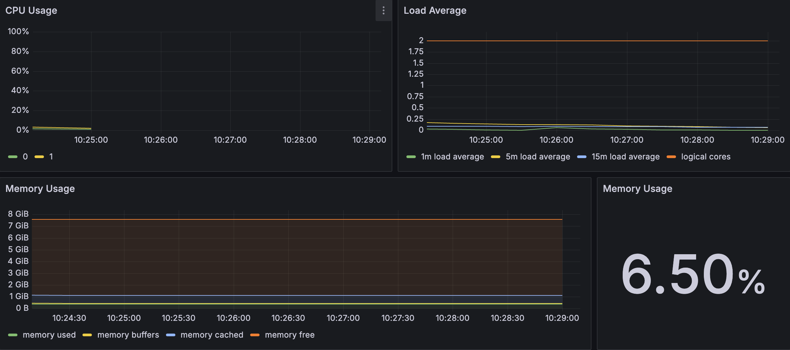
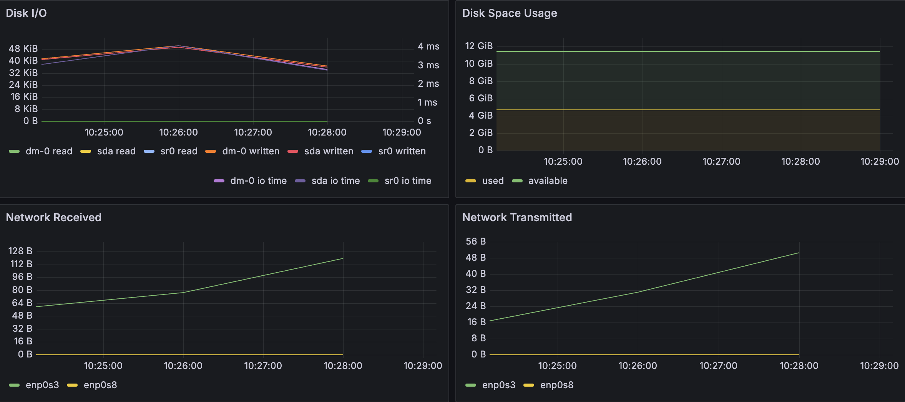
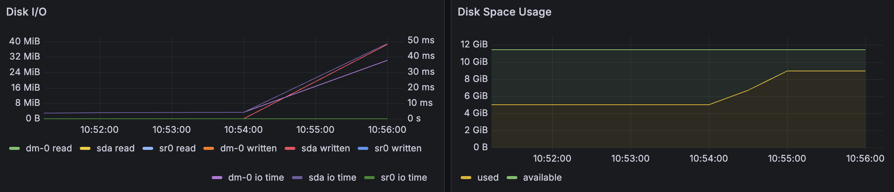
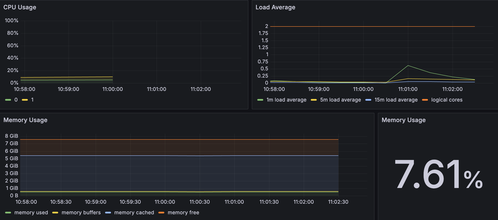
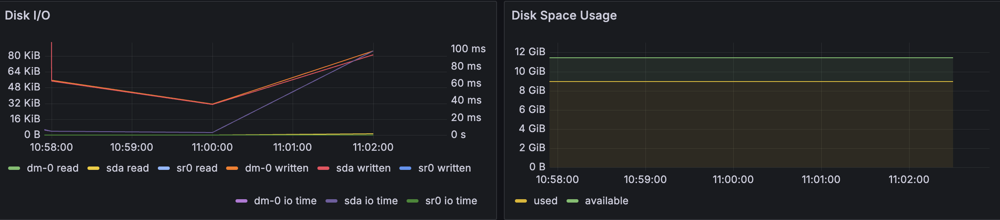
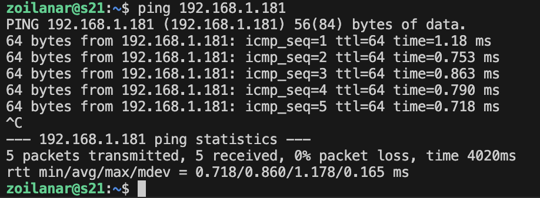
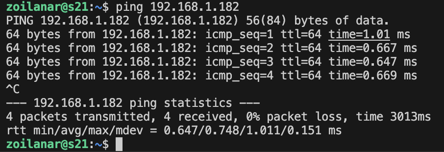
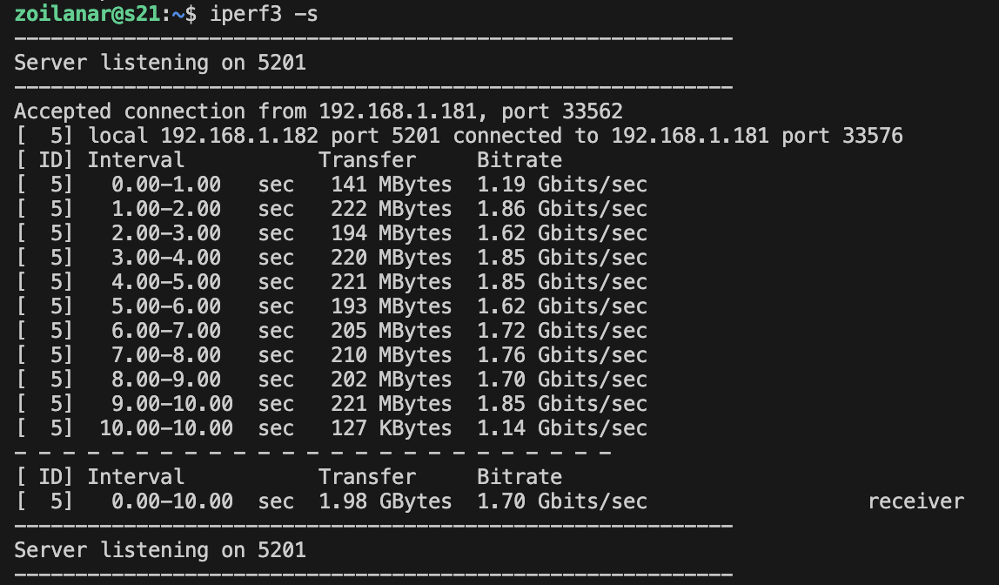
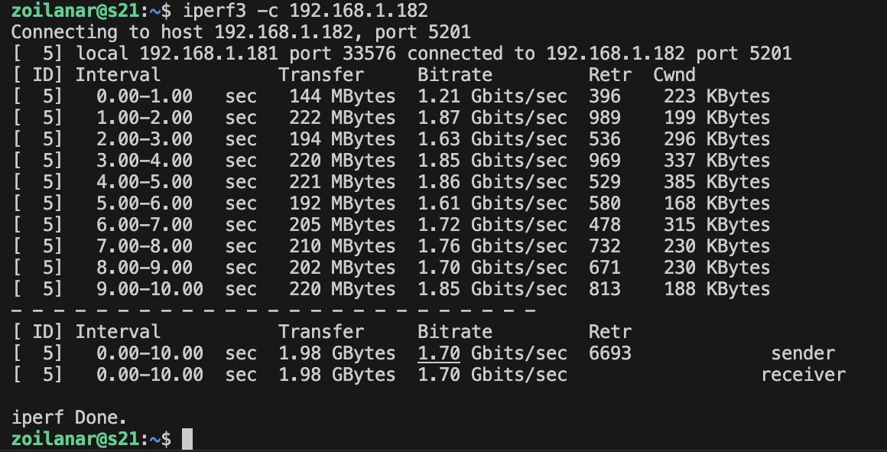
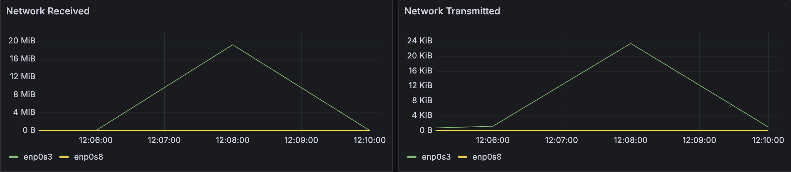

# Part 8. Готовый дашборд

## Содержание

1. [Установка готового дашборда](#1-установка-готового-дашборда)
2. [Мониторинг](#2-мониторинг)
3. [Тест нагрузки сети с помощью утилиты iperf3](#3-тест-нагрузки-сети-с-помощью-утилиты-iperf3)

## 1. Установка готового дашборда

* Скачать `Node Exporter Quickstart and Dashboard` .json:<br/>
  ```
  https://grafana.com/grafana/dashboards/13978-node-exporter-quickstart-and-dashboard/
  ```

* Импортировать `Node Exporter Quickstart and Dashboard` в `Grafana`:<br/>
  <br/>
  <br/>

## 2. Мониторинг

* Запустить bash-скрипт из Части 2 и посмотреть на нагрузку жесткого диска (место на диске и операции чтения/записи)<br/>
  <br/>

* Выполнить команду:<br/>
  ```sh
  $ stress -c 2 -i 1 -m 1 --vm-bytes 32M -t 10s
  ```

  <br/>
  <br/>

## 3. Тест нагрузки сети с помощью утилиты iperf3

* Пропинговать первую машину со второй<br/>
  <br/>

* Пропинговать вторую машину со первой<br/>
  <br/>

* Запустить сервер на первой машине:<br/>
  ```sh
  $ iperf3 -s
  ```
  <br/>

* Запустить клиентскую сторону на второй машине:<br/>
  ```sh
  $ iperf3 -c 192.168.1.182
  ```
  <br/>

* Посмотреть нагрузку сетевого интерфейса:<br/>
  <br/>

[Содержание](#содержание)