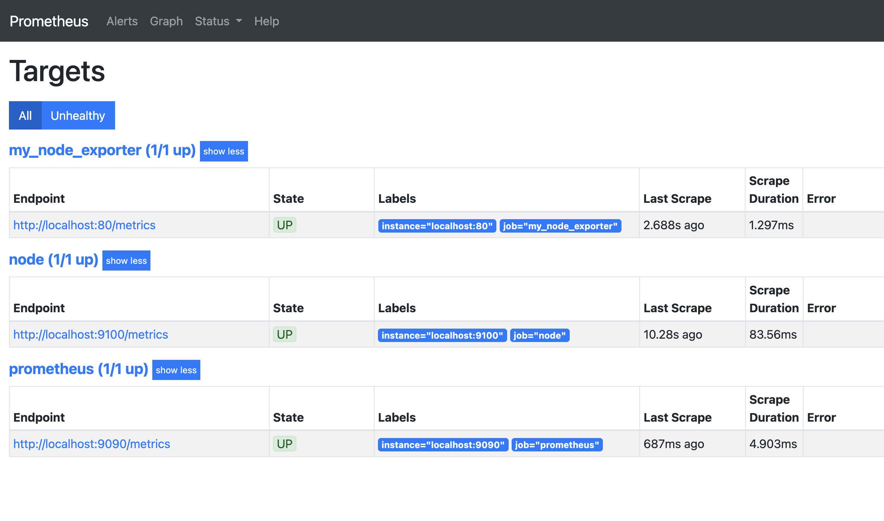
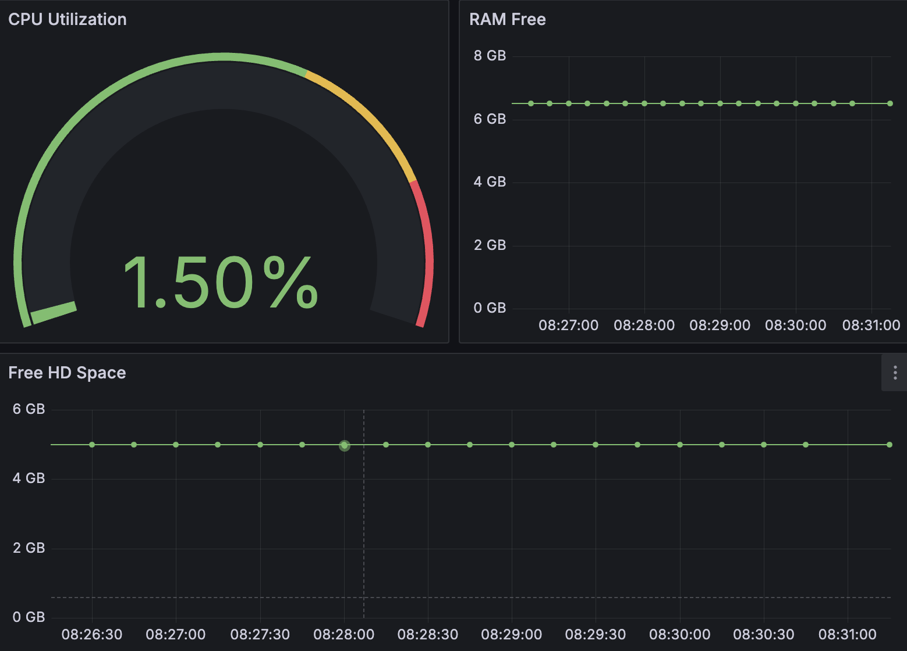
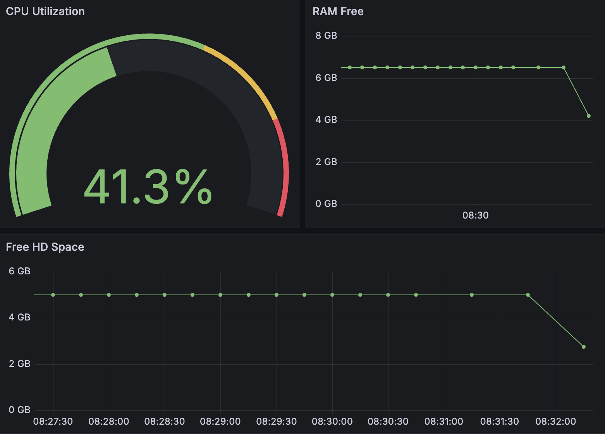
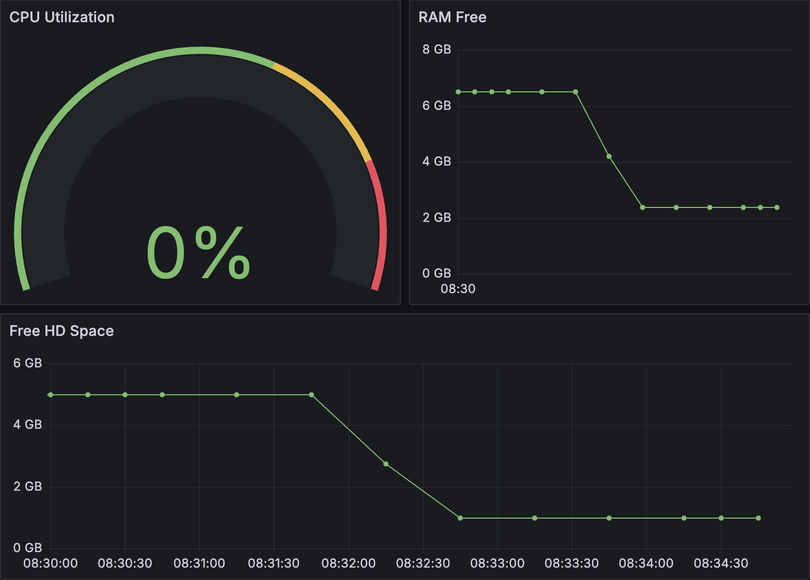
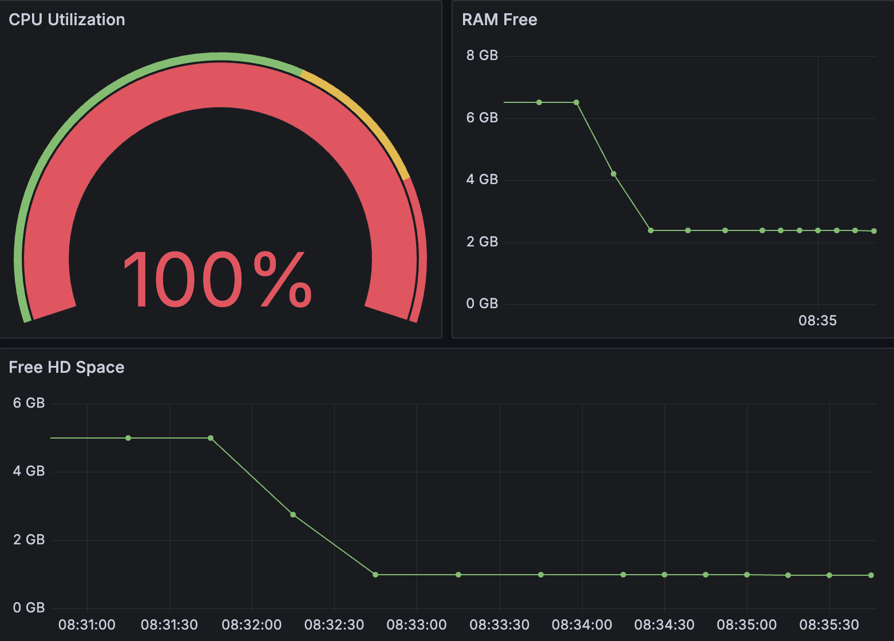

# Part 9. Дополнительно. Свой node_exporter

## Содержание

1. [Написать bash-скрипт](#1-написать-bash-скрипт)
2. [Установка и настройка nginx](#2-установка-и-настройка-nginx)
3. [Настройка Prometheus](#3-настройка-prometheus)
4. [Настройка дашборда](#4-настройка-дашборда)
5. [Мониторинг системы](#5-мониторинг-системы)

## 1. Написать bash-скрипт

* bash-скрипт собирает информацию по базовым метрикам системы (ЦПУ, оперативная память, жесткий диск (объем)).<br/>

* Скрипт формирует html страницу каждые 5 секунд.

## 2. Установка и настройка nginx

* Установить `nginx`:<br/>
  ```sh
  $ sudo apt install nginx
  ```
  
* Создать файл [nginx.conf](nginx.conf)<br/>

* Скопировать файл `nginx.conf` в системный каталог `/etc/nginx/`:<br/>
  ```sh
  $ sudo cp ./nginx.conf /etc/nginx/
  ```

* Перезапустить службу `nginx`:<br/>
  ```sh
  $ systemctl restart nginx.service
  ```

## 3. Настройка Prometheus

* Создать файл [prometheus.yml](prometheus.yml)<br/>

* Скопировать файл `prometheus.yml` в системный каталог:<br/>
  ```sh
  $ sudo cp ./prometheus.yml /etc/prometheus/
  ```

* Перезапустить службу `nginx`:<br/>
  ```sh
  $ systemctl restart prometheus.service
  ```

* Проверить подключение my_node_exporter `http://localhost:8080/metrics`<br/>
  <br/>

## 4. Настройка дашборда

* Настройка дашборда с метриками, подгружаемыми из my_node_exporter<br/>
  <br/>


## 5. Мониторинг системы

* Система во время работы скрипта из Part_2<br/>
  <br/>

* Система после работы скрипта из Part_2<br/>
  <br/>

* Система после выполнения команды:<br/>
  ```sh
  $ stress -c 2 -i 1 -m 1 --vm-bytes 32M -t 10s
  ```
  <br/>

[Содержание](#содержание)

